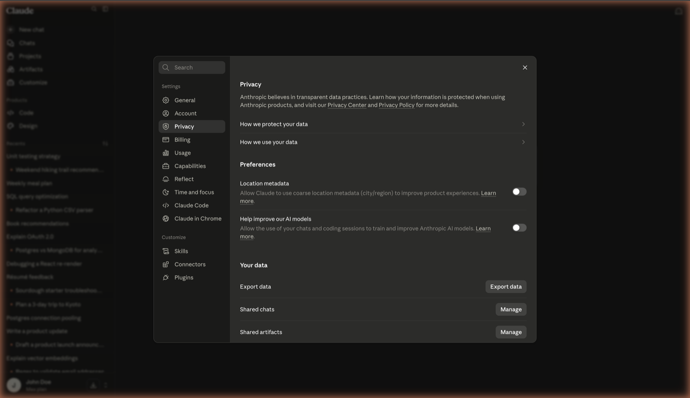
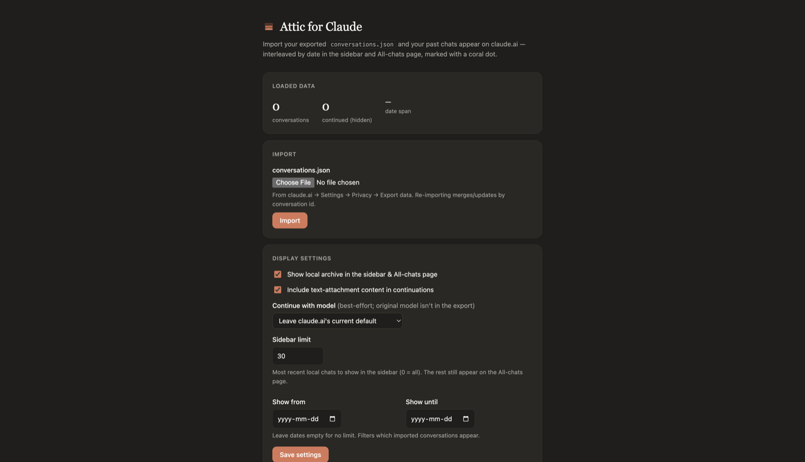
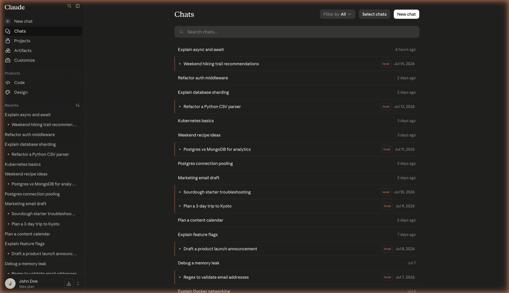
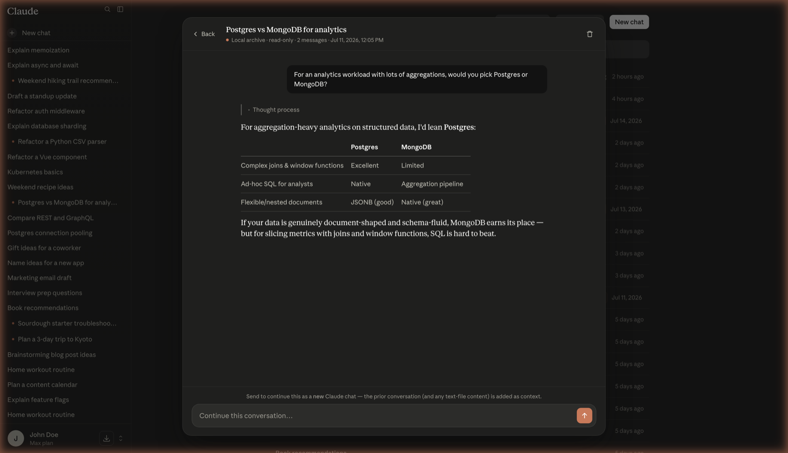
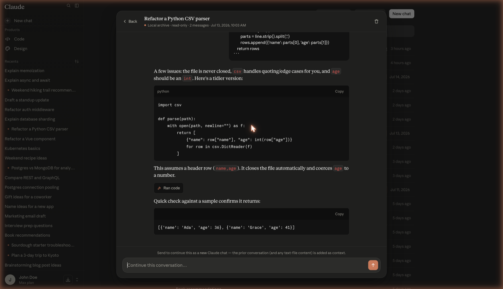
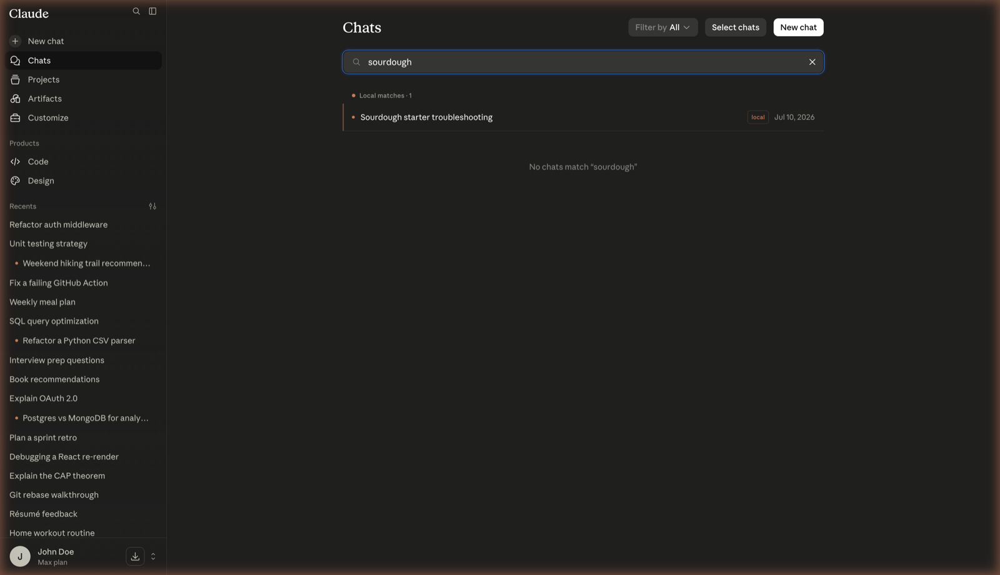
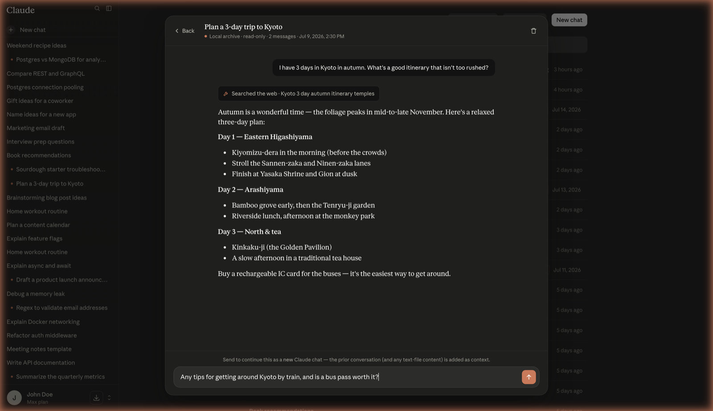
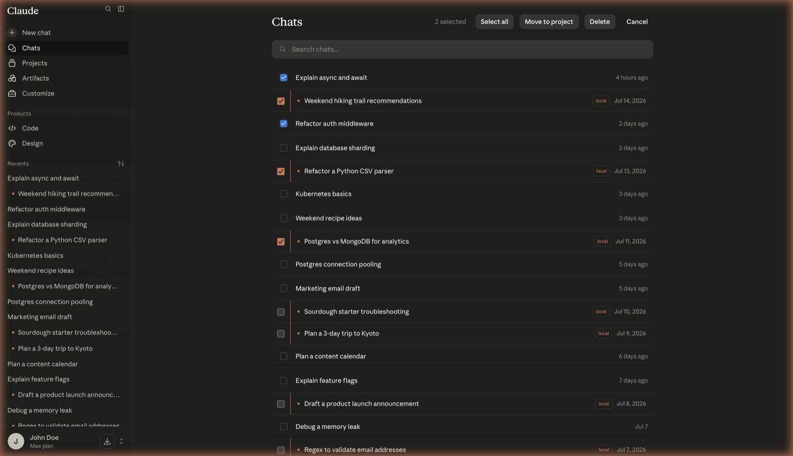
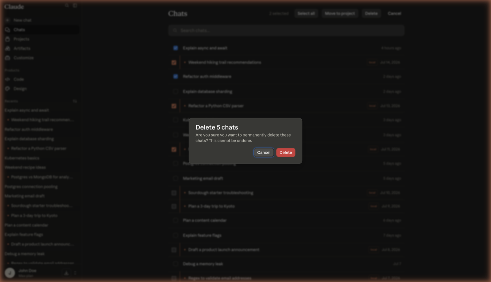

# Attic for Claude User Guide

Attic for Claude is a Chrome extension that brings your exported Claude chat history back into
claude.ai. Your old chats show up right in the sidebar and the Chats page, mixed in by date with
your live chats and marked with a small coral dot. You can read any of them, search them, continue
one in a new chat, or delete them. Everything stays on your computer.

**Install it from the Chrome Web Store:**
[Attic for Claude](https://chromewebstore.google.com/detail/attic-for-claude/nbeehnmaldgfkdpaonolbpjolhecofdc)

> Not affiliated with, endorsed by, or sponsored by Anthropic. "Claude" is a trademark of Anthropic.
> This is an independent tool that works with the claude.ai web app.

## What it does

- Shows your imported chats in the sidebar and the Chats page, mixed in by date, each marked with a coral dot and a `local` badge.
- Opens any imported chat in a clean reader with headings, lists, tables, code, and thinking blocks.
- Searches your imported chats right next to Claude's own results.
- Lets you continue an imported chat in a brand new chat, with the old conversation added as context.
- Lets you select and delete imported and live chats together.
- Keeps everything on your device. Nothing is uploaded.

## 1. Install the extension

The easiest way is the Chrome Web Store:
[Attic for Claude](https://chromewebstore.google.com/detail/attic-for-claude/nbeehnmaldgfkdpaonolbpjolhecofdc).
Open the link and click **Add to Chrome**.

To load it from the source folder instead:

1. Download or clone the extension folder to your computer.
2. Open `chrome://extensions` and turn on Developer mode (top right).
3. Click Load unpacked and pick the extension folder.
4. The Attic icon shows up in your toolbar. Click it to open the options page.

## 2. Export your chats from Claude

First you need your history file from Claude.

1. In claude.ai, open Settings, then the Privacy tab.
2. Click Export data.
3. Anthropic emails you a link. Open the email and click the link to download a zip file.
4. Unzip it. The file you need is `conversations.json`.

*Settings, then Privacy, then Export data.*

## 3. Import into Attic

1. Click the Attic icon in your toolbar to open its options page.
2. In the Import section, click Choose File and pick the `conversations.json` you just unzipped.
3. Click Import. You will see a message like "Imported N conversations".
4. Open or reload claude.ai. Your old chats now appear in the sidebar.

You can re-import any time after a new export. Attic updates by chat, so nothing gets lost.

*The Attic options page. Choose your conversations.json here and click Import.*

## 4. Browse your archive

Your imported chats show up in two places, always mixed in by date with your live chats:

- In the sidebar, under Recents.
- On the Chats page, in the full list.

Each imported chat has a small coral dot and a `local` badge, so it is easy to tell apart from your
live chats.

*Imported chats (coral dot and local badge) mixed in by date with your live chats.*

## 5. Read a chat

Click any imported chat to open it in the reader. It is read only.

*The reader shows your chat faithfully, including tables and thinking blocks.*

*Tool steps (like "Ran code") and code blocks render just like the real thing.*

## 6. Search your archive

Claude's own search runs on its servers, so it cannot see your imported chats. Attic searches them
for you and drops the matches right into the results as you type. Just use the Search chats box.
Your imported matches show up under "Local matches", marked with the same coral dot.

*Your imported chats are searched right alongside Claude's own results.*

## 7. Continue a chat

Want to keep going from an old chat? Open it in the reader, type your next message in the
"Continue this conversation" box, and send. Attic opens a new claude.ai chat with the old
conversation added as context, then adds your message.

1. Open an imported chat in the reader.
2. Type your follow up in the box at the bottom and press the arrow.
3. A new chat opens with the earlier conversation as context. Carry on as normal.

*Type a follow up, and Attic starts a new chat seeded with the earlier conversation.*

> Note: a continued chat is a new conversation with the old one added as context. It is not an exact
> copy of the original. The model and thinking mode are not saved in the export, so you pick a model
> for the continuation in Settings.

## 8. Delete chats

Attic hooks into Claude's own Select chats mode, so you can clean up imported and live chats
together.

1. On the Chats page, click Select chats.
2. Tick any chats you want, imported or live. (Move to project only works for live chats.)
3. Click Delete. The confirmation shows the total across both, for example "Delete 5 chats".
4. Confirm, and a note tells you how many were removed.

*Select imported and live chats together.*

*The confirmation shows the combined total.*

> Deleting an imported chat only removes it from your archive on this device. Your claude.ai account
> is not touched. Deleting a live chat removes it from your account as usual.

## 9. Settings

Open the Attic options page from the toolbar icon to change how the archive behaves. You saw this
page in step 3. Scroll down to Display settings:

- **Show local archive:** turn the whole thing on or off.
- **Sidebar limit:** how many recent imported chats to show in the sidebar. The rest still show on the Chats page. Default is 30.
- **Date range:** show only imported chats between two dates.
- **Continue with model:** pick which model new continued chats should use.
- **Maintenance:** bring back continued chats, or wipe all local data.

## Good to know

- **Everything stays on your device.** Nothing is uploaded. The only network calls are to claude.ai's own API, using your login, to read your chat dates so the mixing by date lines up.
- **Images are not in the export.** Claude's export has links to images, not the image files, so imported images cannot be shown. The reader marks them as "not in export".
- **Re-import any time.** After a new export, import again. Attic updates by chat and keeps the rest.

---

*Attic for Claude. Made by B-Yond. Not affiliated with, endorsed by, or sponsored by Anthropic.*
